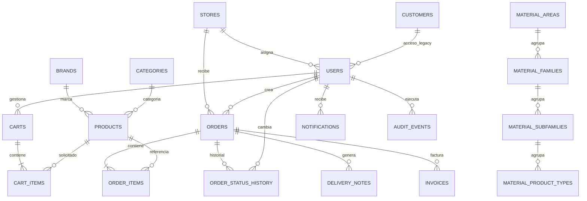

# Estructura de PostgreSQL de WEB B2B

PostgreSQL conserva la seguridad, los carritos, los pedidos B2B y su trazabilidad. Los datos maestros del cliente se consultan en EXITERP mediante `users.erp_customer_code`; no se duplican como fuente maestra en PostgreSQL.

## Tablas y campos principales

| Tabla | Campos funcionales | Relaciones principales |
|---|---|---|
| `users` | `id`, `public_id`, `email`, `password_hash`, `full_name`, `role`, `erp_customer_code`, `active`, `last_login_at` | `customer_id → customers`, `store_id → stores` |
| `customers` | datos de clientes sintéticos/legados; EXITERP sigue siendo la fuente maestra | `usual_store_id → stores` |
| `stores` | código, nombre, dirección, activo | Referenciada por usuarios, inventario, pedidos y documentos |
| `brands` | nombre | Referenciada por productos |
| `categories` | nombre, slug | Referenciada por productos |
| `material_areas` | código, nombre | Padre de familias y clasificación de productos |
| `material_families` | código, nombre | `area_id → material_areas` |
| `material_subfamilies` | código, nombre | `family_id → material_families` |
| `material_product_types` | código, nombre | `subfamily_id → material_subfamilies` |
| `products` | SKU, referencias, descripciones, precio, IVA, clasificación, imagen binaria y procedencia | marca, categoría y jerarquía de materiales |
| `material_import_rows` | archivo, hoja, fila y datos originales JSON | `product_id → products` |
| `carts` | identificador público, código cliente, estado | usuario, cliente legado y tienda |
| `cart_items` | producto y cantidad | `cart_id → carts`, `product_id → products` |
| `orders` | número B2B único, cliente, totales, estado y cuatro campos mínimos de integración EXIT | usuario, cliente legado y tienda |
| `order_items` | SKU, descripción, cantidades pedida/servida/pendiente, precio, zona | `order_id → orders`, `product_id → products` |
| `order_status_history` | estado, nota y fecha | `order_id → orders`, `changed_by_user_id → users` |
| `delivery_notes` | número, total y PDF | cliente, pedido y tienda |
| `invoices` | número, vencimiento, importes, estado y PDF | cliente y pedido |
| `notifications` | título, mensaje y lectura | cliente/usuario |
| `audit_events` | acción, entidad, metadatos JSON y fecha | usuario/cliente |
| `integration_outbox` | evento, payload, estado, intentos y error | Integración asíncrona por `aggregate_id` |
| `professional_registration_requests` | solicitud profesional y aceptación de condiciones | Sin clave externa |

## Tablas documentales que se conservan

`delivery_notes` e `invoices` son tablas transitorias heredadas. La arquitectura objetivo consulta albaranes y facturas directamente en EXITERP; se eliminarán cuando se confirmen los nombres reales de sus tablas y columnas en esa instalación. `python -m scripts.inspect_exit_documents` obtiene ese mapa sin modificar datos.

La depuración elimina `customer_addresses`, `product_images`, `product_relations`, `inventory` e `integration_cursors`: sus funciones fueron sustituidas respectivamente por EXITERP, la imagen binaria de `products`, la ausencia de recomendaciones activas, el stock en línea de EXIT y la consulta directa del tablero.

## Campos de `orders`

| Campo | Tipo | Uso |
|---|---|---|
| `id` | bigint/integer, PK | Identificador interno |
| `public_id` | varchar(36), único | Identificador público de API |
| `order_number` | varchar(40), único | Número propio del pedido B2B; nunca se reemplaza por el número EXIT |
| `nro_pedido_exit` | varchar(80), único si existe | Número asignado por EXIT |
| `fecha_registro_exit` | timestamptz | Fecha y hora de registro en EXIT |
| `origen_pedido` | varchar(20) | `B2B` cuando nace en la web; `EXIT` cuando nace en EXIT |
| `estado_registro_exit` | varchar(80) | Estado original comunicado por EXIT |
| `customer_code` | varchar(40) | Código del cliente en EXITERP |
| `customer_id` | FK nullable | Compatibilidad con clientes PostgreSQL antiguos |
| `user_id` | FK nullable | Usuario que originó o importó el registro |
| `store_id` | FK | Delegación |
| `status` | enum | Estado de trabajo B2B |
| `customer_reference`, `job_name`, `notes` | texto | Datos comerciales del pedido |
| `subtotal`, `tax_total`, `total` | numeric | Importes |
| `created_at`, `updated_at`, `deleted_at` | timestamptz | Auditoría temporal |

## Diagrama de relaciones



Para imprimir el esquema exacto de una instalación, incluidos tipos, nulabilidad, claves y relaciones:

```bash
docker compose -f docker-compose.yml -f docker-compose.prod.yml exec api \
  python -m scripts.describe_postgres_schema
```
